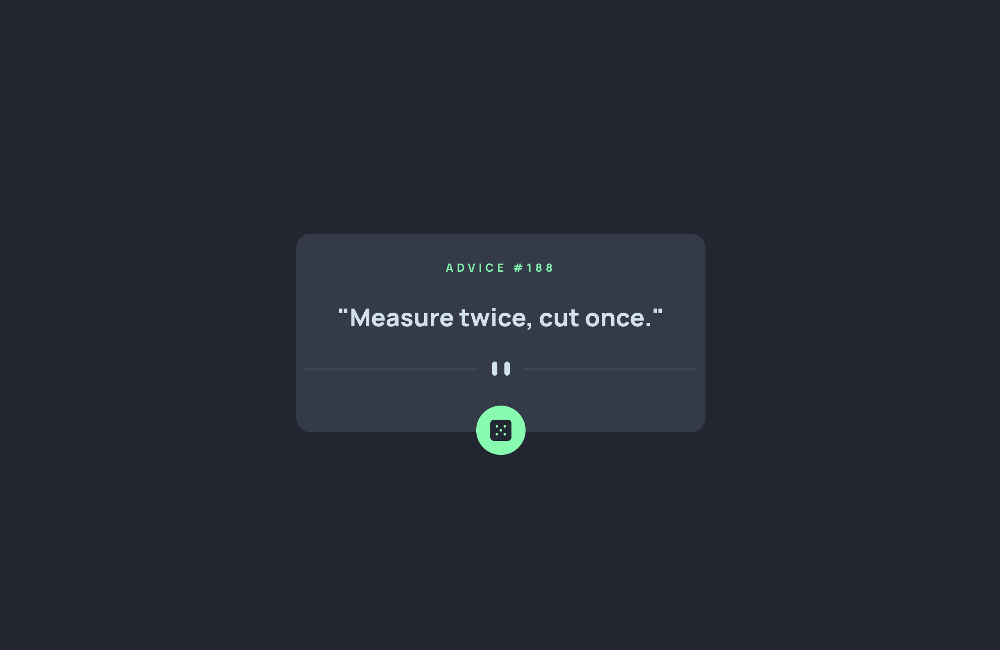

# Advice generator app solution from Frontend Mentor

This is a solution to the [Advice generator app challenge on Frontend Mentor](https://www.frontendmentor.io/challenges/advice-generator-app-QdUG-13db). Frontend Mentor challenges help you improve your coding skills by building realistic projects.

## Overview

### The challenge

Users are able to:

- View the optimal layout for the app depending on their device's screen size
- See hover states for all interactive elements on the page
- Generate a new piece of advice by clicking the dice icon

### Screenshot

### Links

- Solution URL: [Add solution URL here](https://your-solution-url.com)
- Live Site URL: [Add live site URL here](https://your-live-site-url.com)

## My process

### Built with

- [React](https://reactjs.org/)
- Typescript
- Flexbox
- Mobile-first workflow

### What I learned

- Using [React Query](https://tanstack.com/query/v4/?from=reactQueryV3&original=https://react-query-v3.tanstack.com/) for handling API calls.

